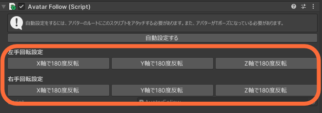

一部アバターは自動設定だけではうまく動作しません。確認済みのアバターを以下にのせています。  
以下に載っていないアバターでも、VRモードで手の角度がおかしくなる事象が発生した場合は、いずれかの軸を反転すると直ることがあります。AvatarFollowコンポーネントについているボタンで設定できます。  
  
※プレイヤーのアバターは関係ありません。ワールドに設置したアバターが以下の場合は対応が必要です。
- ルーニャ
    - 自動設定後、左手・右手それぞれで「X軸に180度反転」する必要があります。