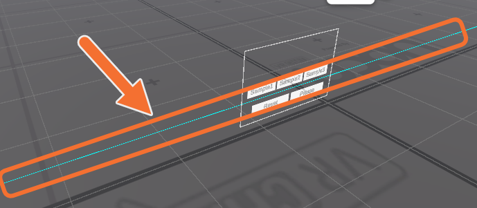

1. VCC Worldプロジェクトを用意
2. **Final IK(有料)またはFinal IK Stub(無料)をインポート**
    - Final IK Stubは以下からダウンロードできます。  
    https://github.com/VRLabs/Final-IK-Stub/releases/latest
    - Final IK Stubは無料ですが、Final IKの機能は入っていないため、Unityエディタ上では動作しません。ギミックのテストをする際はVRChat上で動作確認をしてください。Unityエディタ上でも動作させたい場合は、Final IKの購入を検討してください。
3. 本アセットをインポート
4. Asset内のiruca/AvatarSynchroSystemにある`AvatarSynchroSystem`Prefabをシーンに配置する
5. 位置調整をする
    - シーン上に出てくる青い線が鏡合わせの鏡となる位置です。`base`という名前のオブジェクトを動かすことで調整できます。

6. [**ワールド設置アバターのセットアップ**](./setup.md)**をする**