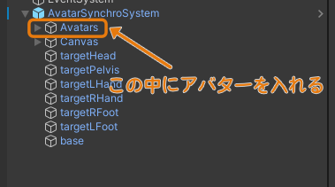
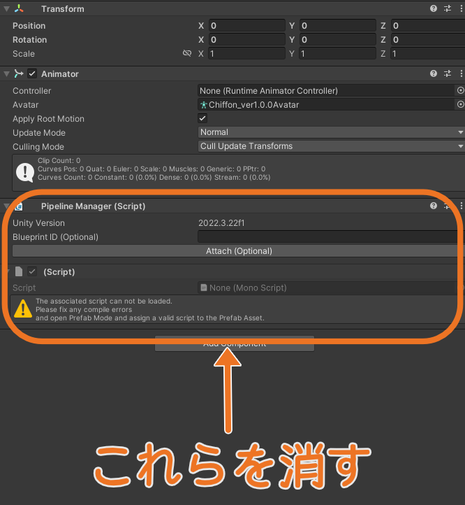
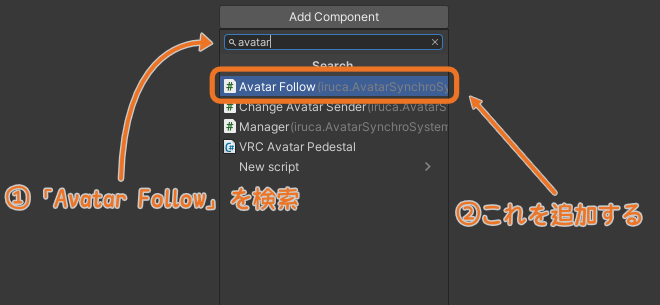
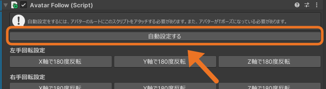

### 事前準備　アバタープロジェクトにあるアバターからアバターを持ってくる場合
衣装展示などでアバターにデフォルトではない衣装を着せて使用する場合、Modular Avatarのコンポーネントが入っていることがあります。  
その場合は、Modular Avatarの機能で`Manual bake avatar`があります。  
アバタープロジェクトで、アバターの一番上の階層を右クリックで`Manual bake avatar`を選択します。  
アバターと衣装のボーンが一体になったアバターのクローンが作成されます。  
それを任意の場所にドラッグしてprefabにし、そのPrefabとアバターのテクスチャ等のデータおよび`Assets/ZZZ_GeneratedAssets`フォルダの中身をエクスポートして、ワールドデータに組み込んで下さい。
詳しくは以下のページをご覧ください。  
https://modular-avatar.nadena.dev/ja/docs/manual-processing

## セットアップ手順
1. ワールドプロジェクトにアバターをインポートする
2. アバターのPrefabを、シーンに配置した本システムのPrefabのAvatarsオブジェクトの中に入れる  

3. 設置したアバターの一番上の階層にある、「!」マークがついているスクリプトと、Pipeline Managerを削除する

4. アバターの一番上の階層(Animatorがついている階層)に、Add Componentから、Avatar Followコンポーネントを検索し、追加する

5. 同コンポーネントの`自動設定する`ボタンを押す

6. **アバターを非アクティブにする**
7. [UIの設定](./ui.md)をする

:::note
一部のアバターでは、自動設定だけでは手の角度がおかしくなることがあります。[追加セットアップが必要なアバター](./avatarinfo.md)を参照してください。
:::