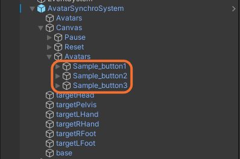
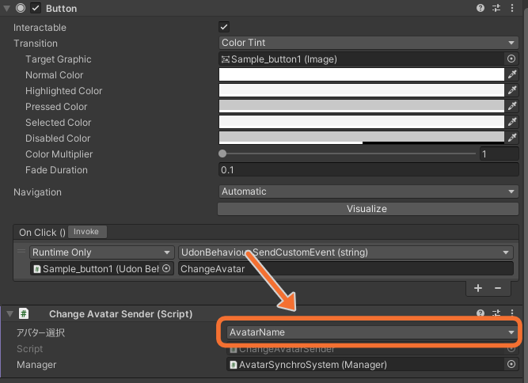
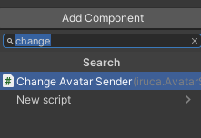
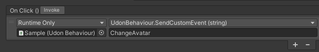

アバターを切り替えられるUIを設定できます。デフォルトのUIの他に、独自でUIを作成してそれを使用することもできます。

## デフォルトのUIを使う場合
アバター切り替えボタンは、`AvatarSynchroSystem/Canvas/Avatars`の中にあります。  
  
このボタンは削除したり複製したりすることができます。ボタンを増やしたり減らしたりすると勝手にいい感じに並べてくれます。

それぞれのボタン選択し、インスペクターからアバターを設定できます。セットアップしたアバターから選択できます。  

## 独自でUIを作成する場合
ボタンに対して以下のセットアップをしてください。
1. Add Componentから、Change Avatar Senderコンポーネントを検索し、追加する  

2. 追加したコンポーネントのManagerフィールドに、AvatarSynchroSystemのルートオブジェクトをドラッグ&ドロップする
3. ButtonのOnClickイベントを以下のように設定する
    - イベントの対象はボタンのオブジェクト
    - UdonBehaviour.SendCustomEvent (string)を選択
    - イベント名は`ChangeAvatar`
