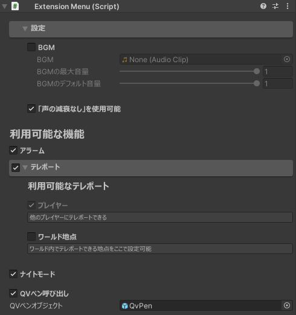

本アセットは、Unityエディタ上で機能の有効化・無効化などを設定できます。ワールドの特性に合わせて設定してください。

シーン上に配置した**ExtensionMenu**オブジェクトを選択すると、インスペクターから設定できます。

**利用可能な機能**以下の項目では、チェックボックスを操作することで機能の有効化・無効化ができます。

import DocCardList from '@theme/DocCardList';

<DocCardList />