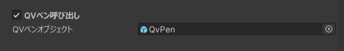

QVペン呼び出し機能を使用するための設定をすることができます。

※別途[QVペン](https://booth.pm/ja/items/1555789)のダウンロードが必要です。

### セットアップ手順
1. QVペンをインポートする
2. QVペンのPrefabをシーンに配置する
3. 拡張メニューのオブジェクトを選択し、インスペクターからQVペンにチェックを入れて有効化する
4. **QVペンオブジェクト**の欄に、シーンに配置したQVペンのオブジェクトを入れる

