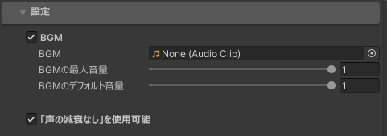

拡張メニューで設定できる設定項目を調整できます。

- ### BGM
    BGMの有効・無効の切り替え、最大音量・デフォルト音量の設定ができます。

- ### 「声の減衰なし」を使用可能
    「声の減衰なし」機能を使用できるかどうか設定できます。ワールドの特性上使用されたくない場合は無効化してください。
    「声の減衰なし」機能については、[拡張メニューの機能](../features.md)を参照してください。