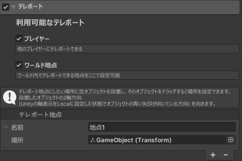
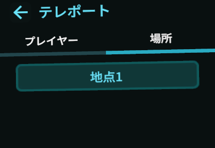
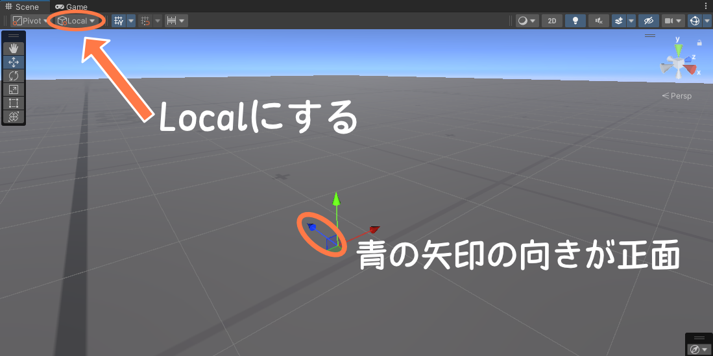

テレポート機能の詳細を設定できます。

### 利用可能なテレポート
利用可能なテレポートの種類を選択できます。テレポート機能を有効にしている場合は少なくとも1つは有効化する必要があります。どちらも使わせたくない場合は、「テレポート」の横にあるチェックボックスを外し、テレポート機能自体を無効化してください。
- プレイヤー
  - ワールド内にいる任意のプレイヤーの位置にテレポートできます。
- ワールド地点
  - ワールド内の指定の場所に、テレポートできる地点を置くことができます。

### テレポート地点の設定について
**ワールド地点**を有効にすると、テレポートする地点を設定するフィールドが出現します。
- 名前
  - 拡張メニューに表示されるテレポート地点の名前になります。

- 場所
  - テレポートさせたい位置に空のオブジェクトを設置し、そのオブジェクトを入れてください。
  - オブジェクトのLocal座標で青の矢印の向きを向いてテレポートすることになります(詳細は画像を参照)。
